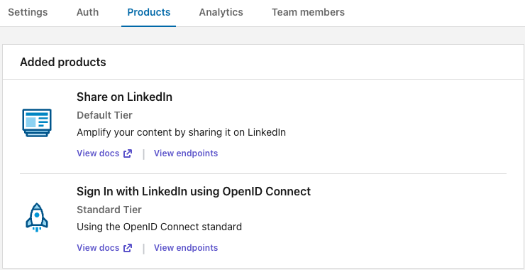
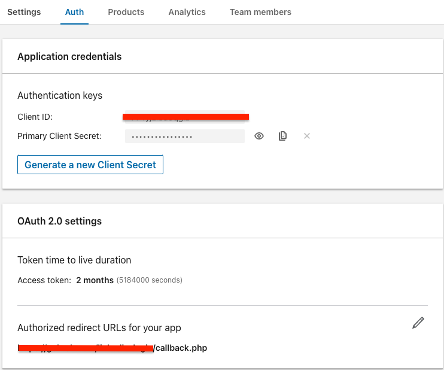
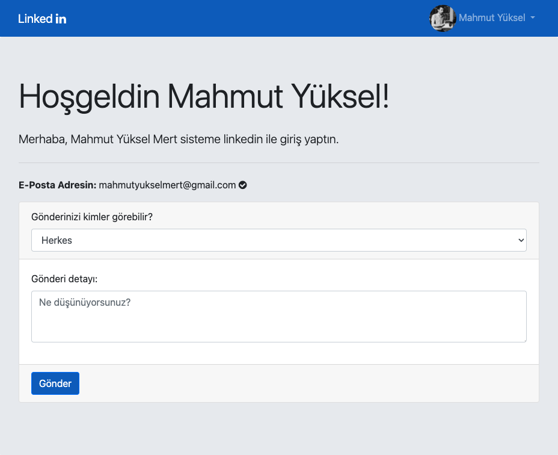

# PHP LinkedIn Auth

A simple PHP class to authenticate with LinkedIn and get the user's profile information. It also allows you to create simple posts.

You can quickly use it in your projects by simply copying and including the [linkedIn.class.php](linkedIn.class.php) file.

## How to Get Started

### Installation

```sh
git clone https://github.com/mahmutyukselmert/php-linkedin-auth.git
```

### Create a New LinkedIn App

Go to [https://developer.linkedin.com/](https://developer.linkedin.com/) and create a LinkedIn application for yourself.

### Add Products to Your Application

Navigate to the 'My Apps' section, and add 'Share on LinkedIn' and 'Sign In with LinkedIn using OpenID Connect' from the 'Products' section of your application.



### Client ID & Client Secret

Add the location of callback.php from the uploaded page under "Authorized redirect URLs for your app".




Edit the [init.php](init.php) file to suit your needs.

```php
<?php

$app_id = ""; //Your App Id
$app_secret = ""; //Your App Secret
$app_callback = "callback.php"; //Your Domain/callback.php
```

### Ready & Preview 


